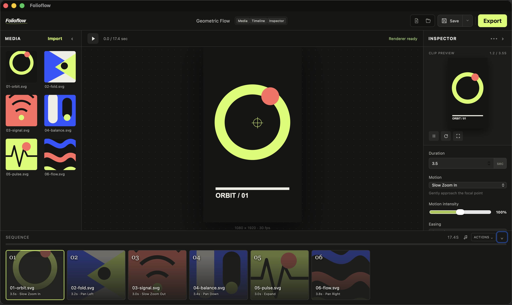
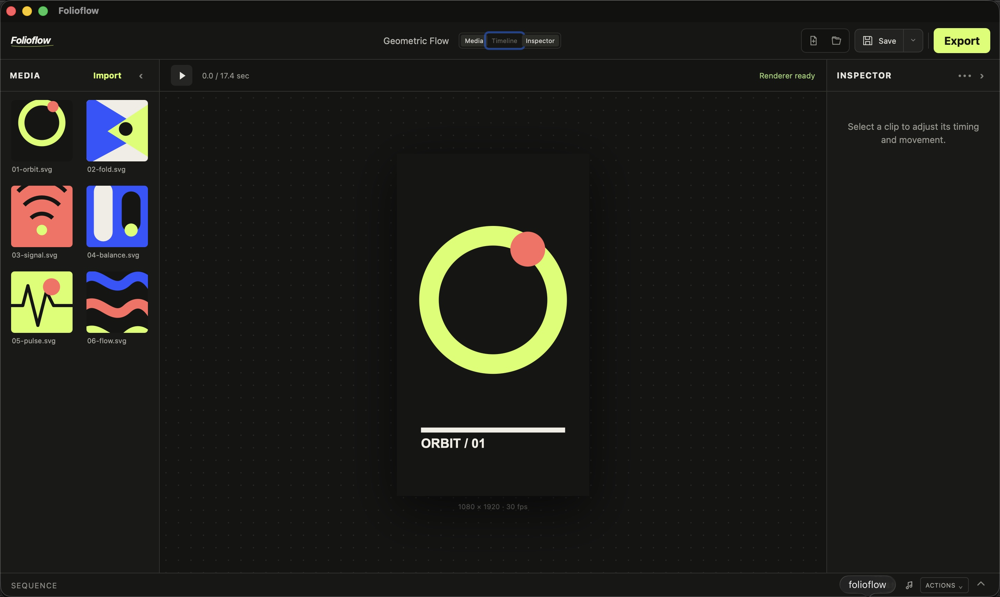
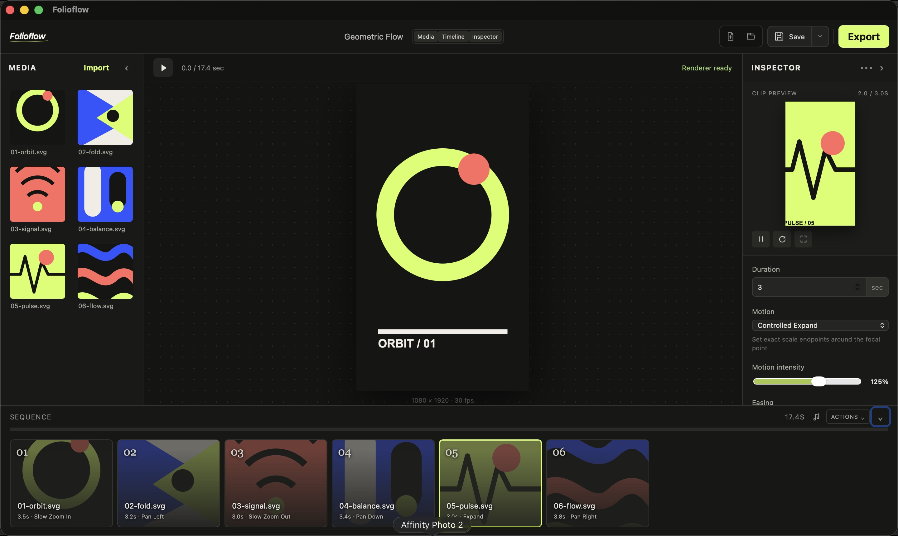
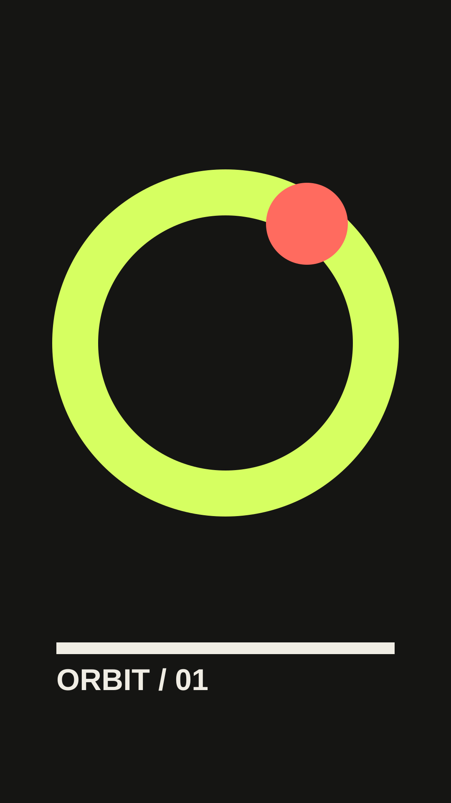

  

  A focused desktop editor for turning still images into polished vertical reels.

  <a href="https://hanifb1360.github.io/Folioflow-Releases/"><strong>Visit the Folioflow website</strong></a>
  &nbsp;·&nbsp;
  <a href="https://github.com/hanifb1360/Folioflow-Releases/releases"><strong>Download for macOS</strong></a>
  &nbsp;·&nbsp;
  <a href="#features">Features</a>

---

## Download

### macOS — Apple Silicon (M1 or later)

The website always resolves the newest published DMG automatically. Folioflow includes its Export Engine, so users do not need to install FFmpeg or use Terminal.

> Folioflow is currently a prerelease. Your feedback on the editing workflow, effects, and exporting is especially welcome.

## Made for still-image storytelling

Folioflow keeps the reel workflow deliberately simple: bring in your artwork, arrange it on a timeline, give each image an intentional movement, add a soundtrack, and export a finished vertical video. It is designed for portfolios, visual stories, and social-first presentations—not a crowded general-purpose video suite.

## Features

- **Image-first timeline** — import artwork and arrange each image as a clip in a clear visual sequence.
- **Per-clip motion** — control zoom, pan, focal point, easing, timing, and transitions for every image.
- **Focused Inspector** — edit the selected clip without losing context; copy and paste motion settings when you need consistency.
- **Single-clip preview** — isolate an image to review its movement before committing to the full sequence.
- **Soundtrack controls** — attach music, set its volume, trim it to the reel, and preview it with the sequence.
- **Vertical export** — render a 1080 × 1920, 30 fps H.264 MP4 suitable for Instagram Reels and other portrait-video platforms.
- **Project files** — save, reopen, and continue editing Folioflow projects locally.

## A calm, purpose-built workspace

The app centres the vertical composition, with the media library on the left, detailed clip controls on the right, and the whole sequence below. Panels can be collapsed when you want more room to focus.

Every image can carry a different movement. The Inspector provides duration, motion style, intensity, easing, focal positioning, and transition controls while keeping a dedicated clip preview visible.

## Geometric Flow demo

The presentation above uses a real Folioflow project built from six original SVG artworks. The complete set is included in [`assets/demo`](assets/demo) so the visual system behind the screenshots is transparent and reusable for release presentation work.

  
  
  
  
  
  

## Getting started

1. Download and open the DMG above.
2. Move **Folioflow** to your Applications folder.
3. Open the app and choose **Import** to add images.
4. Select a clip in the sequence and use the **Inspector** to adjust its motion, timing, and transition.
5. Optionally add music from the soundtrack button in the timeline header.
6. Choose **Export** and select where to save the MP4.

### First launch on macOS

Because Folioflow is currently distributed as a prerelease, macOS may ask you to confirm the first launch. If it does, Control-click the app, choose **Open**, then confirm.

## Release notes

Each push to Folioflow’s private development repository is verified and then published here as a numbered prerelease with a macOS installer. See the [Releases page](https://github.com/hanifb1360/Folioflow-Releases/releases) for all available builds.

## Feedback

Found something that feels wrong or have an idea for the next release? Please open an issue in this repository with a short description, your macOS version, and a screenshot or screen recording when possible.
